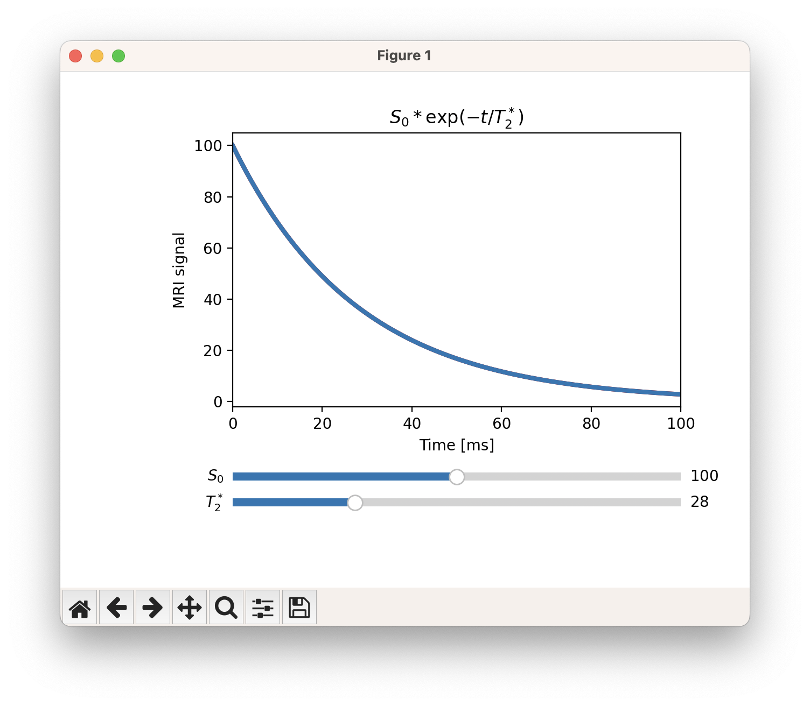

# Understanding fMRI (work in progress...) [OHBM 2024 Brainhack project]
Educational simulations for understanding the MRI signal. This project is created for OHBM Brainhack 2024. The main goal is to create single script simulations that builds up an understanding of the MRI signal step by step. Fundamental papers, and equations will be linked. The long term goal of this project is to build this repository as an educational resource to teach MRI basics. An important source of inspiration for this project is https://www.youtube.com/c/3blue1brown .

## Papers to start from
- **[A very good starting point]** Hagberg, G., Tuzzi, E., 2014. Phase Variations in fMRI Time Series Analysis: Friend or Foe?, in: Advanced Brain Neuroimaging Topics in Health and Disease - Methods and Applications. InTech. https://doi.org/10.5772/58275
- **[On blood oxygenation effect] [Figure 4, Equations 1-2]** Ogawa, S., Lee, T., Nayak, A.S., Glynn, P., 1990. Oxygenation‐sensitive contrast in magnetic resonance image of rodent brain at high magnetic fields. Magnetic Resonance in Med 14, 68–78. https://doi.org/10.1002/mrm.1910140108
- **[On two component model of fMRI signal, Equations 1-4]** Uludag, K., Müller-Bierl, B., Ugurbil, K., 2009. An integrative model for neuronal activity-induced signal changes for gradient and spin echo functional imaging. NeuroImage 48, 150–65. https://doi.org/10.1016/j.neuroimage.2009.05.051
- **[On two component model of fMRI signal] [Equations 1-2]** Boxerman, J.L., Hamberg, L.M., Rosen, B.R., Weisskoff, R.M., 1995. MR contrast due to intravascular magnetic susceptibility perturbations. Magnetic resonance in medicine 34, 555–66.
- **[On magnitude and phase signal distributions] [Figure 1-2]** Gudbjartsson, H., Patz, S., 1995. The rician distribution of noisy mri data. Magnetic Resonance in Med 34, 910–914. https://doi.org/10.1002/mrm.1910340618
- **[On T1 weighted fMRI, Equations 7-11]** Akbari, A., Bollmann, S., Ali, T.S., Barth, M., 2022. Modelling the depth-dependent VASO and BOLD responses in human primary visual cortex. Human Brain Mapping hbm.26094. https://doi.org/10.1002/hbm.26094


# On using the scripts
## Dependencies
[Python](https://www.python.org/downloads/)

| Package                                        | Tested version |
|------------------------------------------------|----------------|
| [matplotlib](http://matplotlib.org/)           | 3.1.1          |
| [NumPy](http://www.numpy.org/)                 | 1.22.0         |

## Getting started
Clone this repository, navigate to the folder, and execute in your terminal:
```
python 01_t2star_v1.py
```

If everything went well, you should be able to see and interactive figure as show below:

